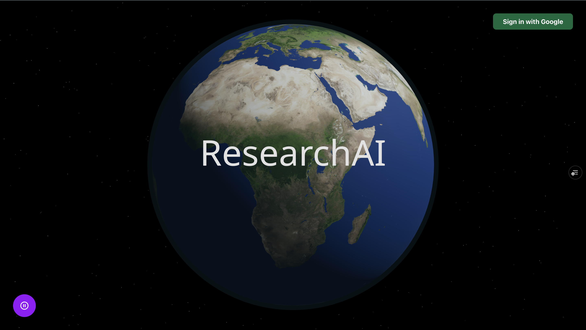
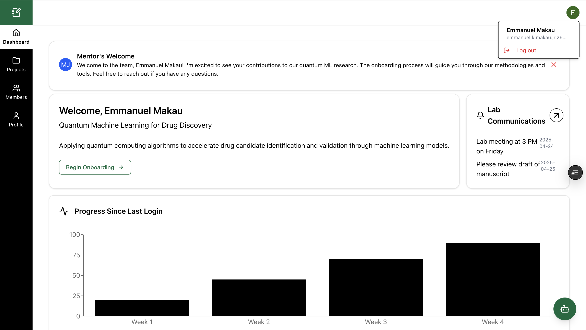
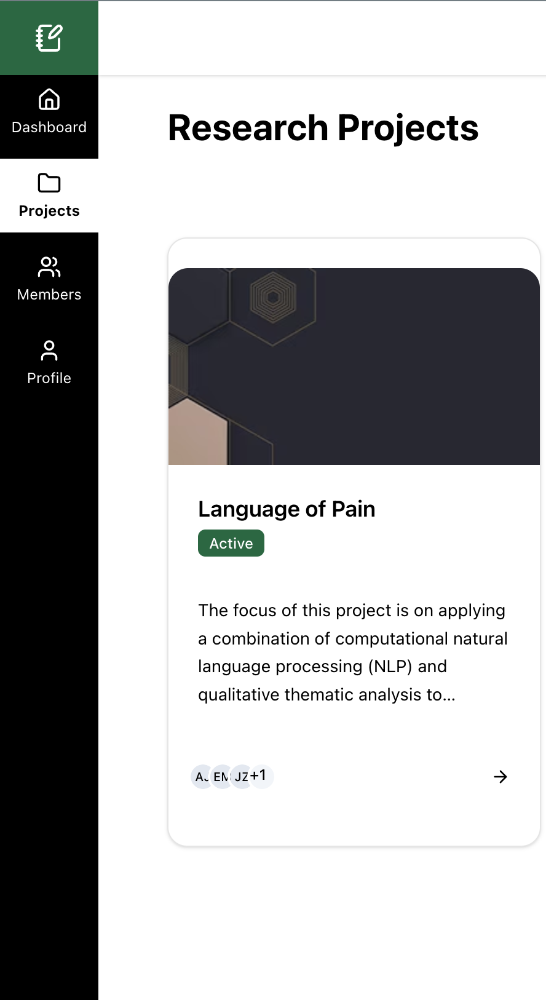
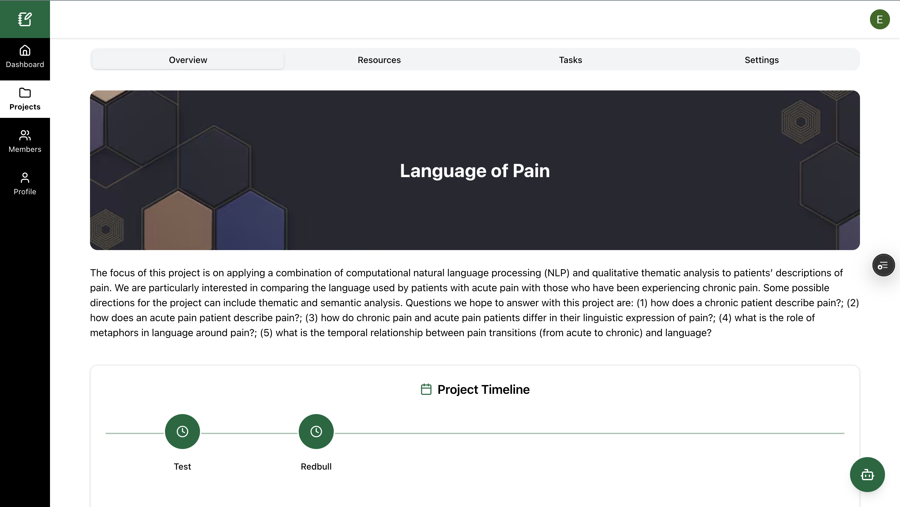
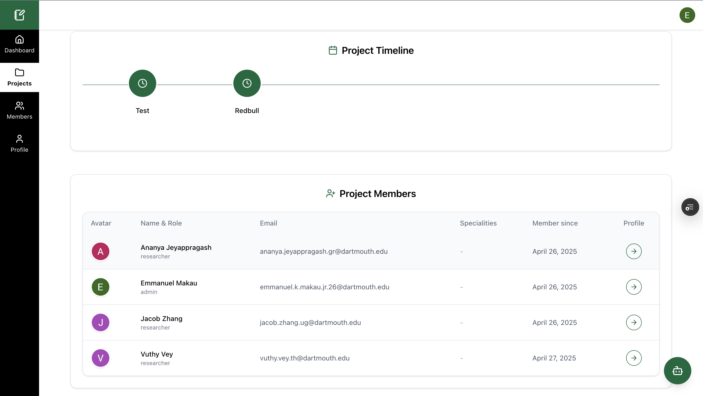
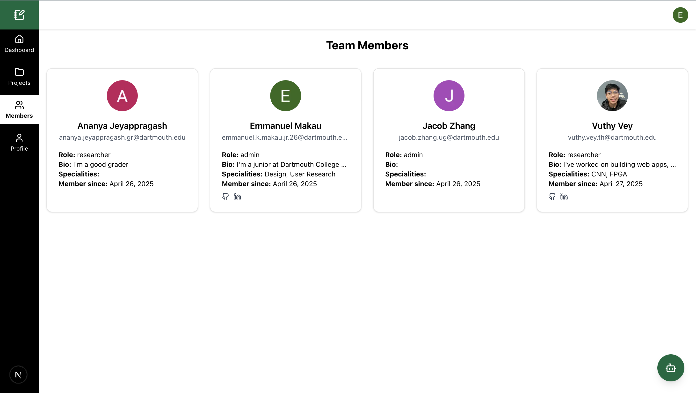
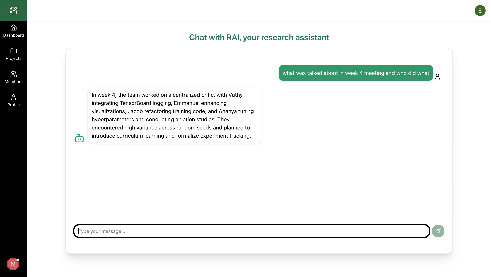

# Research AI

## Inspiration
When our team first met at HackDartmouth, it didn’t take long to realize we all shared the same story: struggling to onboard into our research labs. We remembered digging through scattered protocols, trying to organize papers, and referencing a huge database. Those early frustrations sparked the idea for ResearchAI — an AI-powered research companion designed to make research smoother, more accessible, and more connected especially when onboarding a lab project.
ResearchAI streamlines the entire research process, from onboarding to publication. It auto-generates personalized lab guides, organizes and summarizes literature reviews, keeps teams in sync with smart alerts and unified workspaces. Our goal is to democratize research support and bring global labs and classrooms closer together.

## What it does
- **Collaborative Project Boards**: Shared dashboards for organizing experiments, deadlines, and team roles.  
- **Task Management**: Intuitive to-do list with priority flags, due-date reminders, and progress tracking so nothing falls through the cracks.
- **Easy Onboarding**: Comprehensive project overview and initial task assignment so new lab members can hit the ground running.
- **Centralized Resources**: A unified library for uploading and searching reference papers—available to your entire team.
- **AI Assistant**: High-precision context-aware support for all of your project-related queries.

## How we built it
1. **Frontend**: React with Next.js (TypeScript) and Tailwind CSS for a responsive, component-driven UI.  
2. **Backend**: Node.js with NextAuth + Google OAuth to handle authentication; Firebase (NoSQL) to store application data; Supabase as a vector store for centralized data retrieval via similarity search. Workflow automation powered by n8n, integrating Gemini for embeddings and LLM calls.  
3. **AI Integration**: Gemini 1.5 Pro handles both vector embeddings and LLM tasks, chosen for its optimal balance of speed, accuracy, and cost.  
4. **Workflow Automation**: n8n orchestrates end-to-end processes—file uploads and updates automatically trigger vectorization into Supabase with minimal context loss. A service account issues JWTs and bearer tokens to securely connect our backend to the database.  
5. **Centralized Agent**: A unified AI agent with access to all indexed resources ensures precise, low–false-positive responses across literature summarization, drafting, and project queries.  

## Challenges we ran into
- **Low-Precision Assistant**: Ensuring Gemini was only referencing resources within the organization and not pulling from outside sources.  
- **Configuration Complexity**: Integrating diverse components—NoSQL database, vector store, authentication services, and workflow automation—into a unified, optimized system.  

## Accomplishments that we’re proud of
- **Automated Resource Management**: All files are automatically uploaded to our vectorized database, allowing for quick retrieval via rapid semantic searches using similarity scores.  
- **Truly Accurate AI Assistant**: The assistant only references our vectorized database and clearly indicates when it doesn’t know an answer.  
- **Ease of Use**: One-click Google sign-in—no separate registration required.  

## What we learned
- **Collaboration** — we learned to plan together, delegate tasks, and stay organized to finish the project on time.
- Discovered and used **Live Share in VS Code** for real-time collaborative coding, which made teamwork much more efficient.
**Prompt engineering is an art** — small tweaks to AI prompts significantly improved coherence, human-like responses, and citation consistency.
- Real-time collaboration at scale exposed **edge-case conflicts**, showing us the importance of strong versioning, merge strategies, and technical task management.

## What’s next for ResearchAI
- **Offline Mode**: Local caching for field researchers with limited connectivity.  
- **Advanced Analytics**: Topic-model clustering and trend visualization across your reading history quickly through vectorization.  
- **University Integrations**: LMS plugins for Canvas and Moodle and Slack to bring ResearchAI directly into classroom workflows.  
- **Mobile App**: On-the-go research support for conference and lab bench environments.
- **AI Draft Assistant**: Generates outlines, paragraphs, and citation suggestions for methods, results, and discussion sections.  
- **Multilingual Support**: Translate abstracts and notes into users’ native languages for seamless global teamwork.  
- **Reference Manager**: Automatically format bibliographies in APA, MLA, or journal-specific styles.
- **Smart Literature Search**: Instantly find and summarize relevant papers from multiple sources through vector similarly score saving time on collecting papers for lit reviews.  

For our hackathon project, we chose to integrate the Gemini 1.5 Pro API, to power both our vectorization pipeline and chatbot assistant. We specifically selected Gemini 1.5 Pro for its strong balance between speed and accuracy, allowing our system to deliver fast, precise responses without sacrificing accuracy or increasing latency. Gemini’s advanced language capabilities enabled us to accurately embed and organize all project files — including documents and code — into our Supabase vector database, ensuring high-quality semantic search. One of the key reasons for selecting Gemini was its ability to minimize context loss during vectorization, which is critical for scaling our system while preserving the full meaning of research materials. Its strong semantic understanding also improves retrieval speed and accuracy when users search the database. Additionally, Gemini offers consistently high precision in both retrieval and reasoning tasks, making it an ideal fit for the demands of the research industry, where clarity, depth, and reliability are essential.

1. Screenshots
    
    
    - 
    - 
    - 
    - 
    - 
